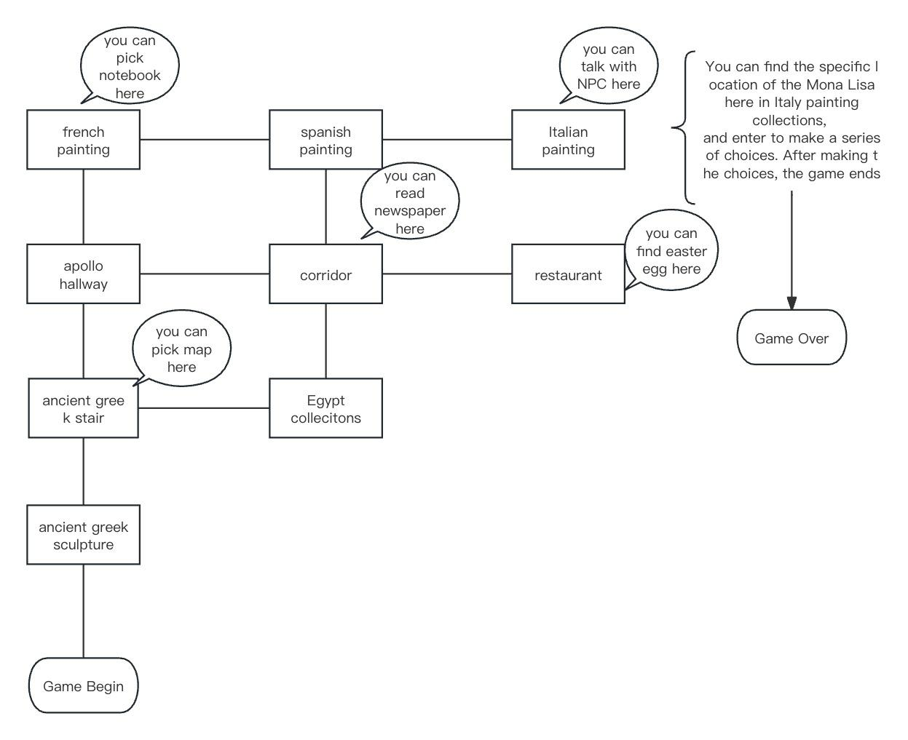

# Save the Most Precious Thing
The game for the Java course project.

## About the Game
This is a text adventure game set in the Louvre Museum in Paris, France. 
You must enter the correct answer to advance the action or location. 
The correct answer is no more than two words and is often a noun, a verb, or a combination of a verb and a noun. 
At the same time, pay attention to the items that appear in the scene, 
since the time of session is restricted. 
When you pick up an item, this item will be removed from the current location. 
When you throw an item away, this item will be placed on the current location.

Hope you enjoy our game (^^)

## Introduction
Today is Monday, the closing day of the Louvre. 
The sun sets in the west, and the golden sunset shines on the huge glass pyramid in front of the Louvre. 
Although you have seen this beautiful scene many times, the sunset still makes you deeply addicted every time. 
While you were immersed in the scenery, you received a message on your phone...

## The Set of Input Commands
The set of input commands is not strict, so there are a few options to designate what you need to do during the game. 
The response for the unappropriated command in some situation is like `It seems like this is not the correct direction...` or `This is not the correct command.`

So, here is the list of the input commands currently supported by the game. 
Not all of them are available at every location. 
All the text in square brackets is optional but if you are typing it,
pay attention to the vertical line which means "or".
 - `[go|move] north|south|east|west|back`;
 - `look [around]|observe|explore`;
 - `take|pick` an item;
 - `drop|throw` an item;
 - `read` a readable item;
 - `[check] inventory`;
 - `help`;
 - `tip`.

## Architectural decisions
You may see them in the UML diagram below. There are highlights of them. 
An abstract class `Character` to represent its children: the main user, NPCs, so-called "friends".
Some of them have their own inventory (the user, an NPC).
The user have also a stack of visited locations while each location have 4 neighbors (one location per a side of the world) like a graph node.

Such game items as the notebook and the museum map extend `AbstractItem` and implement `IApplicable` to be _applicable_, e. g. printing messages while user interacts with them.
Non-applicable items which does not implements `IApplicable` interface (for instance, the newspaper) cannot print such messages.

There are a lot of locations in this game. 
All of them extends the base class `Location` in terms of printing messages when the user enters to a new location. 
All location have also a method to print special messages within the map and 
their own inventory where different items can be stored.
Of course, the location cannot modify its inventory by itself but the user can by taking an item from the location or dropping an item on it.

Parsing and processing of the user input is provided by the `MainLoop` class while the `Command` enumeration contains all commands the game can handle.

The global and static class `TimeCounter` is needed to set time restrictions (we are trying to save the **most** precious thing, right?).
These restrictions include the maximum of the in-game time in minutes, an amount of minutes per a step and the number of a step which corresponds to the command of taking a step. 

## Map

## The UML Diagram
